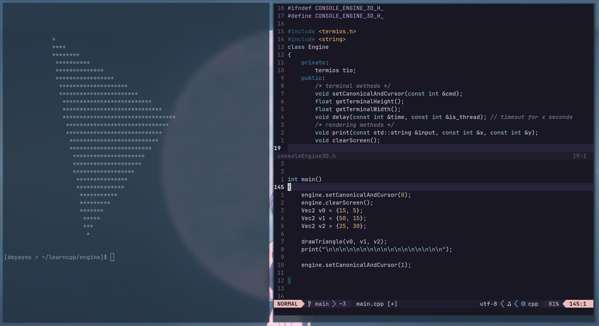
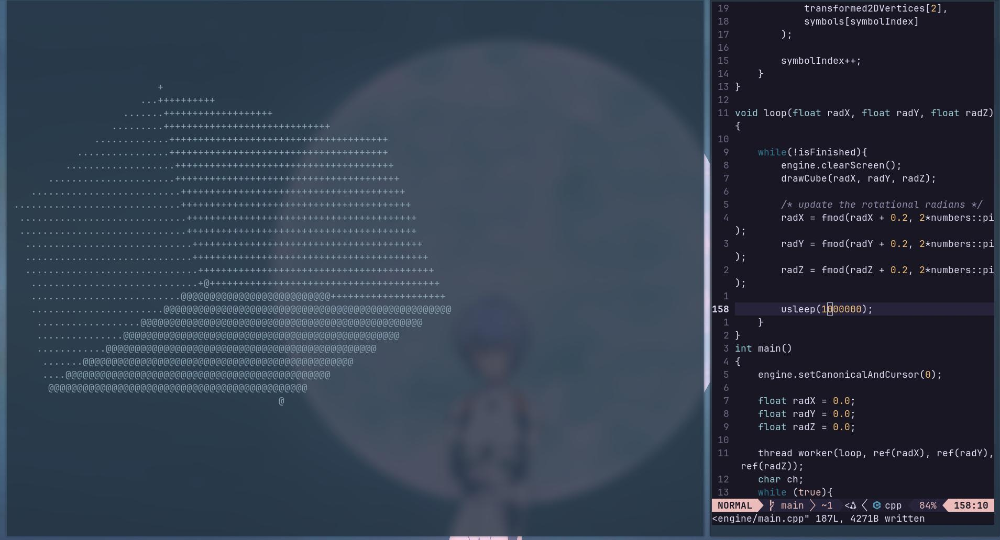

## The Engine
So uhhh yeah if you'd like to render a mysterious rotating cube, or a super bouncy orb, this engine does it all by spitting ASCII characters all over the shell. The terminal being the birthplace of all modern computer graphics gives the inspiration for this tiny engine.

&nbsp;

## (Planned) Features

- Maximize the usage of modern C++ features (i.e. `std::print`, `std::vector`, etc.)
- Minimize external dependencies
- Rigorous documentation on Obsidian
- Write everything from scratch (as much as possible)
- Write code that is easy to read, debug, and change

&nbsp;

## ScreenShots

|  | 
|---|---|
| A tilted triangle | A rotating cube (stationary in the picture but it's moving) |

